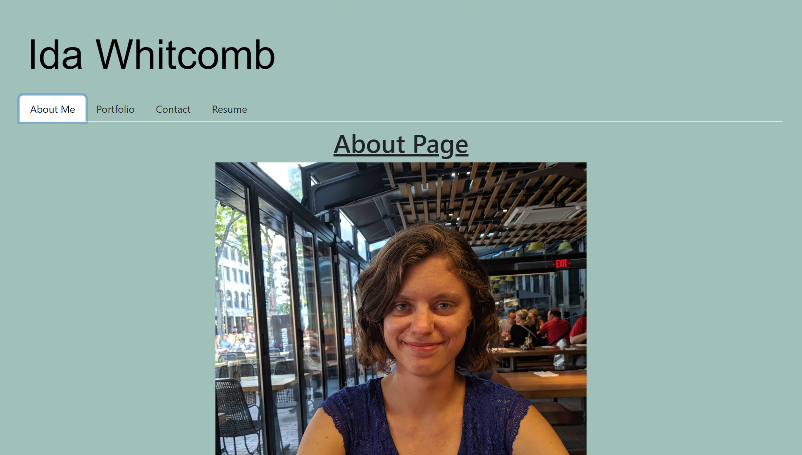

## Ida Whitcomb Portfolio

## Description
A portfolio is an important application that any developer should have. Potential employers will be looking at a developers portfolio to get an idea on the person they may want to hire. This project is my personal portfolio. It contains sections describing myself, listing projects I have completed, and a link to download my resume. It is easy to click through and easy to view.

## Visuals

Deployed Application

## Installation
This program is already deployed on Netlify. Anyone who wishes to view it need only follow the link listed above.

## Usage
This portfolio is for potential empoloyers to view. They may learn a little bit about me personally through my about me page or view past projects that I have worked on to see first-hand what coding skills I have. There is also a Contact Me page where anyone can go and enter their email, name, and a message they would like to send me if they wish. This page does not submit anything to me at this time though, so I have also included my own contact information on this page should anyone need to reach out.

## Contributing
N/A

## Authors and acknowledgment
This program was written by myself, Ida Whitcomb. With help from the learning assistants at askBCS.

## License
N/A

## Project status
This project is a work in process. I will be adding to it and editing it as time goes on with new projects and/or changing up the design.